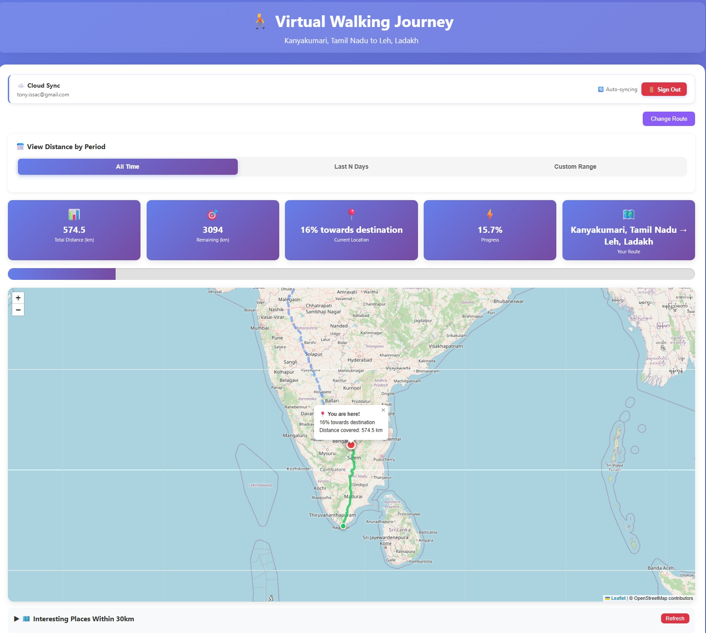
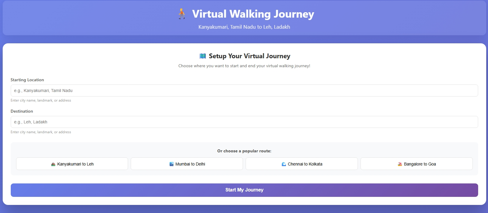
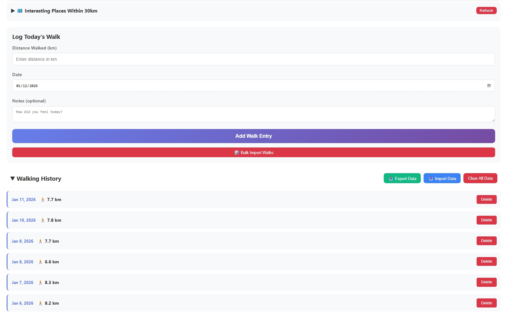
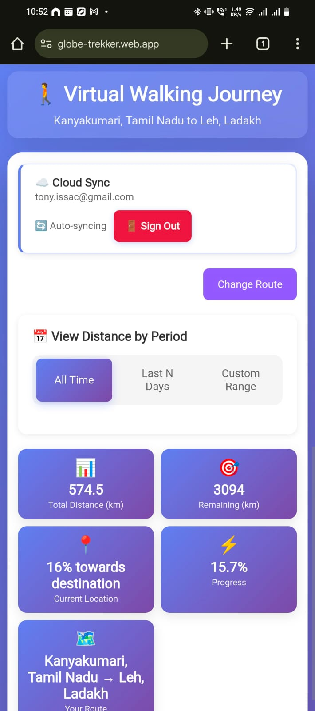
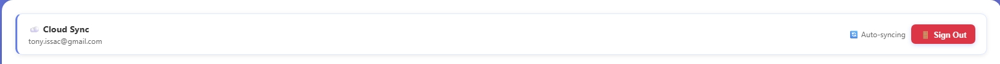

# 🚶 Virtual Walking Journey Tracker

> Track your daily walks and visualize progress on a virtual journey between **ANY two places in the world**!

[](CHANGELOG.md)
[](LICENSE)
[](tests/)
[](manifest.json)

**🌐 Live Demo:** [https://globe-trekker.web.app](https://globe-trekker.web.app)

---

## 📸 Screenshots

<div align="center">

### Main Dashboard

*Interactive map with real road routing and progress tracking*

### Route Setup

*Choose any start and end location worldwide*

### Walk History

*Track all your daily walks with dates and notes*

### Mobile View (PWA)

*Installable Progressive Web App for on-the-go tracking*

### Cloud Sync

*Sign in with Google to sync across devices*

</div>

---

## 📋 Table of Contents

- [Screenshots](#-screenshots)
- [Features](#-features)
- [Quick Start](#-quick-start)
- [Installation](#-installation)
- [Usage](#-usage)
- [Firebase Cloud Sync](#-firebase-cloud-sync-optional)
- [Development](#-development)
- [Testing](#-testing)
- [Deployment](#-deployment)
- [Customization](#-customization)
- [Technologies](#-technologies-used)
- [Contributing](#-contributing)
- [Security](#-security)
- [License](#-license)
- [Contact](#-contact)

---

## ✨ Features

### Core Functionality
- 🌍 **Fully Customizable Routes** - Choose ANY start and end location worldwide
- 🛣️ **Real Road Routing** - Uses OpenStreetMap for actual roads (like Google Maps)
- 📊 **Progress Tracking** - View total distance, remaining, and completion percentage
- 📅 **Daily Logging** - Log walks with distance, date, and notes
- 📜 **Walk History** - View, edit, and delete past walks
- 📍 **Current Position** - See your virtual location on the route

### Advanced Features
- ☁️ **Cloud Sync** - Multi-device sync with Firebase (optional)
- 🔐 **Google Sign-In** - Secure authentication with SSO
- 🗺️ **Nearby Places** - Discover points of interest within 20km
- 📱 **PWA Support** - Install on mobile devices, works offline
- 🎨 **Color-Coded Progress** - Green for completed, blue for pending
- 💾 **Data Export/Import** - Backup and restore your walks
- 📥 **Bulk Import** - Import multiple walks at once

---

## 🚀 Quick Start

### For Users (No Installation)

1. **Visit the live app**: [https://globe-trekker.web.app](https://globe-trekker.web.app)
2. Choose your route (start and end locations)
3. Start logging your daily walks!

### For Developers (Local Setup)

```bash
# Clone the repository
git clone https://github.com/YOUR-USERNAME/walking-journey-tracker.git
cd walking-journey-tracker

# Install dependencies
npm install

# Open in browser
npx http-server .
# Visit http://localhost:8080
```

---

## 📦 Installation

### Prerequisites

- Modern web browser (Chrome, Firefox, Safari, Edge)
- Internet connection (for initial route setup and map tiles)
- Node.js 18+ (for development only)

### Local Development

```bash
# Install dependencies
npm install

# Run linter
npm run lint

# Run tests
npm test

# Run with coverage
npm run test:coverage

# Start local server
npx http-server .
```

---

## 📖 Usage

### 1. Setup Your Route

**Option A: Quick Routes**
- Click one of the preset routes:
  - 🏔️ Kanyakumari to Leh (~4,000 km)
  - 🏙️ Mumbai to Delhi (~1,400 km)
  - 🌊 Chennai to Kolkata (~1,700 km)
  - 🏖️ Bangalore to Goa (~560 km)

**Option B: Custom Route**
- Enter any starting location (e.g., "Paris, France")
- Enter any destination (e.g., "Rome, Italy")
- Click "Start My Journey"
- Wait 5-10 seconds for route calculation

### 2. Log Your Walks

```
Distance: 5.5 km
Date: 2025-12-29
Notes: Morning jog, felt great!
```

### 3. Track Progress

- **Total Distance**: Cumulative km walked
- **Remaining**: Distance left to destination
- **Current Location**: Your virtual position
- **Progress %**: Completion percentage

### 4. Manage Data

**Export Data**
```javascript
Click "📤 Export Data" to download a JSON file
```

**Import Data**
```javascript
Click "📥 Import Data" and select your JSON file
```

**Bulk Import**
```
Format: YYYY-MM-DD, distance_km, notes
Example:
2025-12-25, 5.5, Christmas walk
2025-12-26, 6.2, Post-holiday jog
```

---

## ☁️ Firebase Cloud Sync (Optional)

### Setup Instructions

1. **Create Firebase Project**
   - Go to [Firebase Console](https://console.firebase.google.com/)
   - Click "Add project"
   - Enter project name: "walking-journey-tracker"

2. **Enable Firestore**
   - Navigate to Firestore Database
   - Click "Create database"
   - Start in production mode
   - Choose your region

3. **Enable Authentication**
   - Go to Authentication → Sign-in method
   - Enable "Google" provider
   - Add authorized domain: `your-app.web.app`

4. **Get Configuration**
   - Project Settings → Your apps → Web app
   - Copy Firebase config
   - Paste into `firebase-sync.js`:

```javascript
const firebaseConfig = {
  apiKey: "YOUR_API_KEY",
  authDomain: "your-project.firebaseapp.com",
  projectId: "your-project",
  storageBucket: "your-project.appspot.com",
  messagingSenderId: "123456789",
  appId: "1:123456789:web:abc123"
};
```

5. **Deploy Security Rules**
```bash
firebase deploy --only firestore:rules
```

### Using Cloud Sync

1. Click "☁️ Sign In to Sync"
2. Sign in with your Google account
3. Your data automatically syncs across devices!

---

## 🛠️ Development

### Project Structure

```
walking-journey-tracker/
├── index.html              # Main HTML file
├── style.css               # Styles
├── app.js                  # Core application logic
├── firebase-sync.js        # Cloud sync functionality
├── logger.js               # Structured logging
├── sw.js                   # Service worker (PWA)
├── manifest.json           # PWA manifest
├── tests/                  # Test suites
│   ├── unit/               # Unit tests
│   └── setup.js            # Test configuration
├── package.json            # Dependencies
└── firebase.json           # Firebase configuration
```

### Code Quality

```bash
# Lint code
npm run lint

# Auto-fix linting issues
npm run lint:fix

# Format code
npm run format

# Check formatting
npm run format:check
```

### Testing

```bash
# Run all tests
npm test

# Run tests in watch mode
npm run test:watch

# Generate coverage report
npm run test:coverage
```

**Test Coverage:**
- 52 unit tests across 3 test suites
- Distance calculations (Haversine formula)
- Data validation (walks, dates, bulk import)
- Logger functionality

---

## 🚀 Deployment

### Option 1: Firebase Hosting (Recommended)

```bash
# Install Firebase CLI
npm install -g firebase-tools

# Login to Firebase
firebase login

# Initialize Firebase
firebase init hosting
# Select your project
# Public directory: . (current directory)
# Single-page app: No
# GitHub Actions: Yes (optional)

# Deploy
firebase deploy
```

Your app will be live at: `https://your-project.web.app`

### Option 2: GitHub Pages

```bash
# In repository settings:
# Pages → Source → Deploy from branch
# Branch: main, Folder: / (root)
```

### Option 3: Static Hosting

Upload all files to any static hosting provider:
- Netlify
- Vercel
- AWS S3 + CloudFront
- Azure Static Web Apps

---

## 🎨 Customization

### Change Colors

Edit `style.css`:

```css
:root {
    --primary-color: #667eea;    /* Main accent color */
    --secondary-color: #764ba2;   /* Gradient end color */
    --success-color: #22c55e;     /* Completed route */
    --pending-color: #3b82f6;     /* Pending route */
}
```

### Modify Routes

Edit `app.js` to add more quick routes:

```javascript
function setQuickRoute(start, end) {
    document.getElementById('startLocation').value = start;
    document.getElementById('endLocation').value = end;
}

// Add your custom route button in HTML
<button onclick="setQuickRoute('Tokyo, Japan', 'Kyoto, Japan')">
    🗾 Tokyo to Kyoto
</button>
```

### Adjust Map Settings

```javascript
// In app.js, initMap() function
map = L.map('map').setView([20.5937, 78.9629], 5);  // Center & zoom
```

---

## 🔧 Technologies Used

### Frontend
- **HTML5** - Structure
- **CSS3** - Styling with gradients and animations
- **JavaScript ES6+** - Core functionality with async/await

### Libraries
- **Leaflet.js 1.9.4** - Interactive maps
- **Font Awesome 6.4.0** - Icons

### APIs
- **Nominatim (OpenStreetMap)** - Geocoding (location → coordinates)
- **OSRM** - Real road routing calculations
- **Overpass API** - Nearby points of interest

### Backend (Optional)
- **Firebase Authentication** - Google Sign-In
- **Firebase Firestore** - Real-time database
- **Firebase Hosting** - Static hosting with CDN

### Testing
- **Jest 29.7.0** - Testing framework
- **@testing-library/dom** - DOM testing utilities

### Code Quality
- **ESLint** - JavaScript linting
- **Prettier** - Code formatting

---

## 🤝 Contributing

We welcome contributions! See [CONTRIBUTING.md](CONTRIBUTING.md) for guidelines.

### Quick Contribution Guide

1. **Fork the repository**
2. **Create a feature branch**
   ```bash
   git checkout -b feature/amazing-feature
   ```
3. **Make your changes**
4. **Run tests**
   ```bash
   npm test
   npm run lint
   ```
5. **Commit changes**
   ```bash
   git commit -m "feat: add amazing feature"
   ```
6. **Push to branch**
   ```bash
   git push origin feature/amazing-feature
   ```
7. **Open a Pull Request**

---

## 🔒 Security

### Reporting Vulnerabilities

If you discover a security vulnerability, please **DO NOT** open a public issue.

Instead, email: **tony.issac@gmail.com**

See [SECURITY.md](SECURITY.md) for our security policy.

### Security Features

- ✅ HTTPS-only deployment (Firebase Hosting)
- ✅ Firestore security rules (user data isolation)
- ✅ Google SSO authentication
- ✅ No sensitive data in client-side code
- ✅ Input validation and sanitization

---

## 📄 License

This project is licensed under the MIT License - see the [LICENSE](LICENSE) file for details.

---

## 📞 Contact

**Tony Isaac**
- Email: tony.issac@gmail.com
- GitHub: [@YOUR-USERNAME](https://github.com/YOUR-USERNAME)

**Project Links:**
- Live Demo: https://globe-trekker.web.app
- Repository: https://github.com/YOUR-USERNAME/walking-journey-tracker
- Issues: https://github.com/YOUR-USERNAME/walking-journey-tracker/issues

---

## 🙏 Acknowledgments

- **OpenStreetMap** - Map data and routing
- **Leaflet.js** - Interactive map library
- **Firebase** - Authentication and cloud sync
- **OSRM** - Real-time route calculations

---

## 📊 Changelog

See [CHANGELOG.md](CHANGELOG.md) for version history.

---

## 🎯 Roadmap

### Version 1.1 (Planned)
- [ ] Fitness app integration (Google Fit, Apple Health)
- [ ] Dark mode
- [ ] Multiple simultaneous routes
- [ ] Social sharing features
- [ ] Walking challenges and achievements

### Version 2.0 (Future)
- [ ] Real-time location tracking
- [ ] AR walking mode
- [ ] Community leaderboards
- [ ] Walking groups and teams

---

**Happy Walking! 🚶‍♂️🚶‍♀️**

*Made with ❤️ for fitness enthusiasts worldwide*
